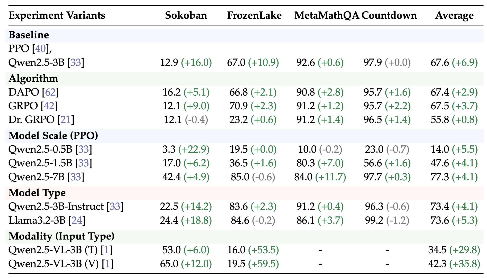
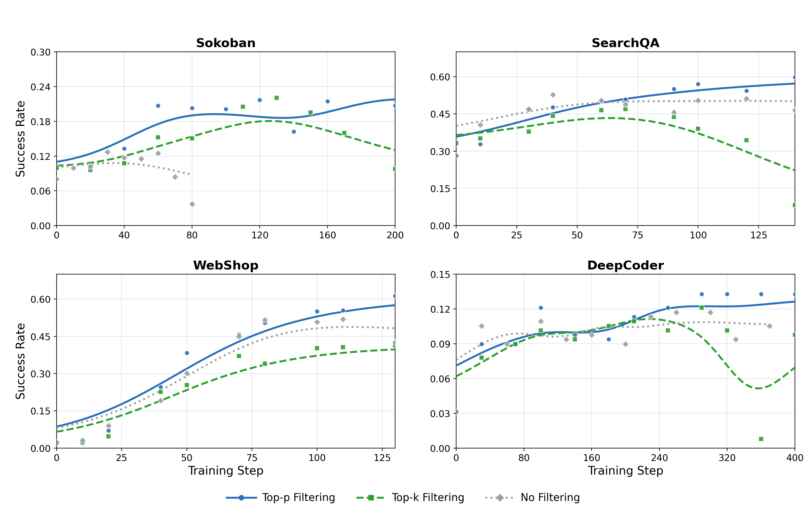

<h1 align="center"> RAGEN: Training Agents by Reinforcing Reasoning </h1>


<p align="center"></p>


<p align="center" style="font-size: 18px;">
  <strong>RAGEN</strong> (<b>R</b>easoning <b>AGEN</b>t, pronounced like "region") leverages reinforcement learning (RL) to train <br>
  <strong>LLM reasoning agents</strong> in interactive, stochastic environments.<br>
  <em>RAGEN v2 introduces a systematic study of reasoning collapse in agent RL and lightweight interventions to fix it.</em>
</p>


<p align="center">
  <!-- TODO: replace XXXX.XXXXX with actual v2 arXiv ID once available -->
  <a href="https://arxiv.org/abs/XXXX.XXXXX"></a>
  <a href="https://arxiv.org/abs/2504.20073"></a>
  <a href="https://ragen-ai.github.io/"></a>
  <a href="https://ragen-doc.readthedocs.io/"></a>
  <a href="https://x.com/wzihanw/status/1915052871474712858"></a>
  <a href="https://api.wandb.ai/links/zihanwang-ai-northwestern-university/a8er8l7b"></a>

</p>

## What's New in v2

**"Understanding Reasoning Collapse in LLM Agent Reinforcement Learning"**

1. **Template Collapse** -- A newly identified failure mode where LLM agent reasoning appears diverse on a per-input basis but becomes input-agnostic across inputs. This collapse is invisible to standard entropy metrics.
2. **Information-Theoretic Decomposition** -- We decompose output entropy as H(Z) = I(X;Z) + H(Z|X), providing two diagnostic axes that separate input-dependent diversity from input-independent randomness.
3. **MI Proxy Metrics** -- Practical mutual-information proxies (Retrieval-Acc, MI-ZScore-EMA) computed from batch likelihoods without external models.
4. **SNR Mechanism & SNR-Adaptive Filtering** -- A gradient decomposition revealing how low within-prompt reward variance produces noisy updates, plus a lightweight filtering fix based on reward variance.
5. **Expanded Scope** -- 7+ environments, 4 RL algorithms (PPO / DAPO / GRPO / Dr.GRPO), scales 0.5B--7B, Qwen + Llama backbones, and multimodal support.

## Update Log

**2026.3.11 -- RAGEN v2 released.** Major update: reasoning collapse analysis, MI proxy metrics, SNR-Adaptive Filtering, expanded environments and algorithms. See [v2 paper](https://arxiv.org/abs/XXXX.XXXXX). <!-- TODO: update date and arXiv link -->

<details>
<summary>Older updates</summary>

**2025.5.8 Update:**
We now release the official [Documentation](https://ragen-doc.readthedocs.io/) for RAGEN. The documentation will be continuously updated and improved to provide a comprehensive and up-to-date guidance.

**2025.5.2 Update:**
We now release a [tracking document](https://docs.google.com/document/d/1bg7obeiKTExuHHBl5uOiSpec5uLDZ2Tgvxy6li5pHX4/edit?usp=sharing) to log minor updates in the RAGEN codebase.


**2025.4.20 Update:**

Our RAGEN [paper](https://arxiv.org/abs/2504.20073) is out!

We've further streamlined the RAGEN codebase (v0423) to improve development.
1. Architecture: Restructured veRL as a submodule for better co-development
2. Modularity: Divided RAGEN into three components--Environment Manager, Context Manager, and Agent Proxy, making it significantly simpler to add new environments (details below), track environmental dynamics, and run multiple experiments


**2025.4.16 Update:**

We recently noticed that a [third-party website](https://ragen-ai.com) has been created using our project's name and content. While we appreciate the interest in the project, we'd like to clarify that this GitHub repository is the official and primary source for all code, updates, and documentation.
If we launch an official website in the future, it will be explicitly linked here.

Thank you for your support and understanding!


**2025.3.13 Update:**


We are recently refactoring RAGEN code to help you better develop your own idea on the codebase. Please checkout our [developing branch](https://github.com/ZihanWang314/RAGEN/tree/main-new). The first version decomposes RAGEN and veRL for better co-development, taking the latter as a submodule rather than a static directory.

**2025.3.8 Update:**

1. In previous veRL implementation, there is a [KL term issue](https://github.com/volcengine/verl/pull/179/files), which has been fixed in recent versions.
2. We find evidence from multiple sources that PPO could be more stable than GRPO training in [Open-Reasoner-Zero](https://x.com/rosstaylor90/status/1892664646890312125), [TinyZero](https://github.com/Jiayi-Pan/TinyZero), and [Zhihu](https://www.zhihu.com/search?type=content&q=%E6%97%A0%E5%81%8FGRPO). We have changed the default advantage estimator to GAE (using PPO) and aim to find more stable while efficient RL optimization methods in later versions.

**2025.1.27:**

We are thrilled to release RAGEN! Check out our post [here](https://x.com/wzihanw/status/1884092805598826609).

</details>


## Overview

Reinforcement Learning (RL) with rule-based rewards has shown promise in enhancing reasoning capabilities of large language models (LLMs). However, existing approaches have primarily focused on static, single-turn tasks like math reasoning and coding. Extending these methods to agent scenarios introduces two fundamental challenges:

1. **Multi-turn Interactions**: Agents must perform sequential decision-making and react to environment feedback
2. **Stochastic Environments**: Uncertainty where identical actions can lead to different outcomes

To address these challenges, we propose a general RL framework: **StarPO** (**S**tate-**T**hinking-**A**ctions-**R**eward **P**olicy **O**ptimization), a comprehensive RL framework that provides a unified approach for training multi-turn, trajectory-level agents with flexible control over reasoning processes, reward assignment mechanisms, and prompt-rollout structures.
Building upon StarPO, we introduce **RAGEN**, a modular agent training and evaluation system that implements the complete training loop, including rollout generation, reward calculation, and trajectory optimization. RAGEN serves as a robust research infrastructure for systematically analyzing LLM agent training dynamics in multi-turn and stochastic environments.

**Reasoning Collapse.** During RL training, LLM agents are prone to *template collapse*--a failure mode where reasoning traces become input-agnostic, relying on fixed templates regardless of the input. Standard entropy metrics fail to detect this because per-input diversity can remain high. RAGEN v2 provides information-theoretic diagnostic tools and a lightweight intervention (SNR-Adaptive Filtering) that mitigates collapse and improves training stability.


## Key Concepts

### Template Collapse

Template collapse is a failure mode where an LLM agent's reasoning appears diverse for any single input but becomes identical *across* different inputs. The model converges to a fixed reasoning template that ignores input specifics. Standard output-entropy metrics H(Z) remain high (since per-input samples look varied), masking the collapse. Detecting it requires measuring the *mutual information* between input and output.

### Information-Theoretic Decomposition

We decompose total output entropy into two diagnostic axes:

**H(Z) = I(X; Z) + H(Z|X)**

- **I(X; Z)** (Mutual Information): How much the output depends on the input. Low MI signals template collapse.
- **H(Z|X)** (Conditional Entropy): Diversity of outputs for a given input. High values indicate stochastic/random outputs.

<p align="center"></p>
<p align="center" style="font-size: 14px; max-width: 700px; margin: 0 auto;">
Four quadrants of reasoning behavior on the Entropy (H) vs. Mutual Information (I) plane: Template Collapse (high H, low I), Low-Entropy Collapse (low H, low I), Diverse Reasoning (high H, high I), and Compressed Reasoning (low H, high I).
</p>

### SNR-Adaptive Filtering

Gradient analysis reveals that RL updates decompose into a *signal* component (driven by within-prompt reward variance) and a *noise* component. When all rollouts for a prompt receive similar rewards, the signal-to-noise ratio (SNR) drops and updates become noisy, accelerating collapse. **SNR-Adaptive Filtering** discards low-variance prompts, retaining only prompts whose rollouts show meaningful reward spread.

<p align="center"></p>
<p align="center" style="font-size: 14px; max-width: 800px; margin: 0 auto;">
SNR-Adaptive Filtering pipeline: (1) sample rollouts per prompt and compute rewards, (2) compute within-prompt reward variance (RV), (3) rank prompts by RV cumulatively and apply a Top-P threshold — low-variance prompts are discarded to filter out noisy gradients, keeping only prompts with meaningful task signal.
</p>


## Algorithm

RAGEN introduces a reinforcement learning framework to train reasoning-capable LLM agents that can operate in interactive, stochastic environments.

<p align="center"></p>
<p align="center" style="font-size: 16px; max-width: 800px; margin: 0 auto;">
The StarPO (State-Thinking-Action-Reward Policy Optimization) framework with two interleaved stages: <b>rollout stage</b> and <b>update stage</b>. LLM iteratively generates reasoning-guided actions to interact with the environment to obtain trajectory-level rewards for LLM update to jointly   optimize reasoning and action strategies.
</p>

The framework consists of two key components:

### > MDP Formulation
We formulate agent-environment interactions as Markov Decision Processes (MDPs) where states and actions are token sequences, allowing LLMs to reason over environment dynamics. At time t, state $s_t$ transitions to the next state through action $a_t$ following a transition function. The policy generates actions given the trajectory history. The objective is to maximize expected cumulative rewards across multiple interaction turns.

### > StarPO: Reinforcing Reasoning via Trajectory-Level Optimization
StarPO is a general RL framework for optimizing entire multi-turn interaction trajectories for LLM agents.
The algorithm alternates between two phases:

#### Rollout Stage: Reasoning-Interaction Trajectories
Given an initial state, the LLM generates multiple trajectories. At each step, the model receives the trajectory history and generates a reasoning-guided action: `<think>...</think><ans> action </ans>`. The environment receives the action and returns feedback (reward and next state).

#### Update Stage: Multi-turn Trajectory Optimization
After generating trajectories, we train LLMs to optimize expected rewards. Instead of step-by-step optimization, StarPO optimizes entire trajectories using importance sampling. This approach enables long-horizon reasoning while maintaining computational efficiency.
StarPO supports multiple optimization strategies:
- **PPO**: Token-level advantages estimated via a value function over trajectories
- **GRPO**: Normalized reward assigned to the full trajectory
- **DAPO**: Dynamic sampling with adaptive clipping for exploration
- **Dr.GRPO**: Variance-reduced GRPO with baseline correction

SNR-Adaptive Filtering integrates at the update stage by discarding low-variance prompts before the policy gradient step (see [`docs/guide_rollout_filtering.md`](docs/guide_rollout_filtering.md)).

Rollout and update stages interleave in StarPO, enabling both online and offline learning.


## Supported Environments

| Environment | Type | Code |
|---|---|---|
| Sokoban | Grid puzzle, multi-turn | `ragen/env/sokoban/` |
| FrozenLake | Navigation, stochastic | `ragen/env/frozen_lake/` |
| MetaMathQA | Math reasoning | `ragen/env/metamathqa/` |
| Countdown | Arithmetic | `ragen/env/countdown/` |
| WebShop | E-commerce, multi-turn | `ragen/env/webshop/` |
| SearchQA | Information retrieval | `ragen/env/search/` |
| DeepCoder | Code synthesis | `ragen/env/deepcoder/` |
| Bandit | Decision making | `ragen/env/bandit/` |
| ALFWorld | Embodied, multi-turn | `ragen/env/alfworld/` |
| Sudoku | Logic puzzle | `ragen/env/sudoku/` |


## Environment Setup

This setup has been validated on `H100`, `H200`, and `B200`, and supports: `bandit`, `sokoban`, `frozenlake`, `metamathqa`, `countdown`, `deepcoder`.

**Requirements:** `CUDA >= 12.8`

### 1. Clone the repository

```bash
git clone https://github.com/mll-lab-nu/RAGEN.git
cd RAGEN
```

### 2. Create and activate the conda environment

```bash
conda create -n ragen python=3.12 -y
conda activate ragen
```

### 3. Run the environment setup script

```bash
bash scripts/setup_ragen.sh
```

If you want to install the `search` environment, use the following command:

```bash
bash scripts/setup_ragen.sh --with-search
```

This release setup does not install `webshop`. If you need `webshop`, see [docs/experiment_webshop_release.md](docs/experiment_webshop_release.md) for its separate setup flow.

For detailed setup instructions, also check our [documentation](https://ragen-doc.readthedocs.io/).

## Training Models
Here's how to train models with RAGEN:

### Export variables and train
We provide default configuration in `config/base.yaml`. This file includes symbolic links to:
- `config/ppo_trainer.yaml`
- `config/envs.yaml`

The base configuration automatically inherits all contents from these two config files, creating a unified configuration system.

To train:

```bash
python train.py --config-name base
```

To select a different RL algorithm, set the algorithm in your config or override on the command line (PPO, GRPO, DAPO, Dr.GRPO are supported).

To enable SNR-Adaptive Filtering, configure the rollout filter settings in your config. See [`docs/guide_rollout_filtering.md`](docs/guide_rollout_filtering.md) for details.

### Parameter efficient training with LoRA

### Saving compute
By default our code is runnable on A100 80GB machines. If you are using machine with lower memory (e.g. RTX 4090), please consider adapting below parameters, like follows (performance might change due to smaller batch size and shorter context length):
```bash
python train.py \
  micro_batch_size_per_gpu=1 \
  ppo_mini_batch_size=8 \
  actor_rollout_ref.rollout.max_model_len=2048 \
  actor_rollout_ref.rollout.response_length=128
```

#### Parameter efficient training with LoRA
We provide a default configuration with LoRA enabled in `config/base-lora.yaml`. To customize the LoRA settings, see the the `lora` section at the top of the configuration file. The current settings are:

```yaml
lora rank: 64
lora alpha: 64
actor learning rate: 1e-5
critic learning rate: 1e-4
```


## Performance

We evaluate RAGEN v2 across multiple algorithms (PPO, DAPO, GRPO, Dr.GRPO), model scales (0.5B--7B), model families (Qwen, Llama), and modalities (text, vision). SNR-Adaptive Filtering consistently improves performance across configurations.

### Main Results

<p align="center"></p>
<p align="center" style="font-size: 14px; max-width: 800px; margin: 0 auto;">
Performance across algorithms, model scales, model types, and modalities. Green arrows indicate improvements from SNR-Adaptive Filtering.
</p>

### Filtering Comparison

<p align="center"></p>
<p align="center" style="font-size: 14px; max-width: 800px; margin: 0 auto;">
Training curves comparing Top-p Filtering vs. Top-k vs. No Filtering across Sokoban, SearchQA, WebShop, and DeepCoder. Top-p filtering consistently outperforms alternatives.
</p>

Key observations:
- SNR-Adaptive Filtering (Top-p) provides consistent improvements across environments, algorithms, and model scales.
- The filtering mechanism is lightweight and easy to integrate into existing training pipelines.
- Benefits are most pronounced in stochastic, multi-turn environments where reward variance across prompts varies widely.

Reproduction scripts: [`scripts/runs/run_main_table_diff_algo.sh`](scripts/runs/run_main_table_diff_algo.sh), [`scripts/runs/run_main_table_diff_size.sh`](scripts/runs/run_main_table_diff_size.sh), [`scripts/runs/run_main_table_diff_model.sh`](scripts/runs/run_main_table_diff_model.sh). See [`docs/experiment_main_table.md`](docs/experiment_main_table.md) for full reproduction details.


## Visualization
Please check the `val/generations` metric in your wandb dashboard to see the trajectories generated by the model throughout training. Check this [relevant issue](https://github.com/RAGEN-AI/RAGEN/issues/84) for more information.


## Evaluation
RAGEN provides a easy way to evaluate a model:
```bash
python -m ragen.llm_agent.agent_proxy --config-name <eval_config>
```
The proxy now loads `config/eval.yaml` by default, which only keeps the rollout-specific knobs required for evaluation. You can still point to any other file via `--config-name`. Each evaluation config supports an `output` block so you can control where rollouts are stored and which fields are persisted:

```yaml
output:
  dir: results/eval
  filename: val_rollouts.pkl
  append_timestamp: true   # include run timestamp in the file name
  keep_batch_keys: ["rm_scores", "responses"]   # set to null to keep everything
  keep_non_tensor_keys: null
  keep_meta_info: true
```

With this configuration the proxy filters the `DataProto` before saving (handy if you want to drop large tensors such as log-probs) and places the artifact directly under `results/eval`.
You only need to set model and environment to evaluate in `config/<eval_config>.yaml`.
To limit how many previous turns the model sees during evaluation, you can set `agent_proxy.max_context_window` in your config file.


## Modular System Design of RAGEN

We implement RAGEN as a modular system: there are three main modules: **Environment State Manager** (`ragen/llm_agent/es_manager.py`), **Context Manager** (`ragen/llm_agent/ctx_manager.py`), and **Agent Proxy** (`ragen/llm_agent/agent_proxy.py`).

- Environment State Manager (**es_manager**):
  - Supports multiple environments (different environments, same environment different seeds, same environment same seed)
  - Training seeds are controlled via `seed.train` in the config. The manager increments this seed each reset so runs are deterministic.
  - Records states of each environment during rollout
  - Processes actions from **ctx_manager**, executes step, and returns action results (observations) to **ctx_manager** in a batch-wise manner
- Context Manager (**ctx_manager**):
  - Parses raw agent tokens into structured actions for the **es_manager**
  - Formats observation from **es_manager**, parses and formulates them for following rollout of agent.
  - Supports a `max_context_window` hyperparameter, which limits how many previous turns of interaction history are retained in the model's input.
  - Gathers final rollout trajectories and compiles them into tokens, attention masks, reward scores, and loss masks for llm updating.
- Agent Proxy (**agent_proxy**): Serves as the interface for executing single or multi-round rollouts

## Adding Custom Environments

To add a new environment to our framework:

1. Implement an OpenAI Gym-compatible environment in `ragen/env/new_env/env.py` with these required methods:
   - `step(action)`: Process actions and return next state
   - `reset(seed)`: Initialize environment with new seed
   - `render()`: Return current state observation
   - `close()`: Clean up resources

2. Define environment configuration in `ragen/env/new_env/config.py`

3. Register your environment in `config/envs.yaml`:
   ```yaml
   custom_envs:
     - NewEnvironment # Tag
       - env_type: new_env  # Must match environment class name
       - max_actions_per_traj: 50  # Example value
       - env_instruction: "Your environment instructions here"
       - parallel_friendly: false # Set to true if your environment supports parallel execution.
       - max_workers: 128 # If parallel_friendly=True, max_workers threads will be used.
       - env_config: {}  # Configuration options from config.py
   ```
   (Hint: Due to the extra time cost associated with using a thread pool, there is a trade-off between the pool's overhead and the speed of the environment itself. It is recommended to enable the parallelism only for complex environments. Meanwhile, running the RNG-dependent environments inside shared thread pools means multiple workers touch Python's global random state concurrently, so even with the same seed, interleaving differs per run when setting `parallel_friendly=True`.)

4. Add the environment tag to the `es_manager` section in `config/base.yaml`

## Using RAGEN with dstack

[dstackai/dstack](https://github.com/dstackai/dstack) is an open-source container orchestrator that simplifies distributed training across cloud providers and on-premises environments
without the need to use K8S or Slurm.

### 1. Create fleet

Before submitting distributed training jobs, create a `dstack` [fleet](https://dstack.ai/docs/concepts/fleets).

### 2. Run a Ray cluster task

Once the fleet is created, define and apply a Ray cluster task:

```shell
$ dstack apply -f examples/distributed-training/ray-ragen/.dstack.yml
```

You can find the task configuration example at [`examples/distributed-training/ray-ragen/.dstack.yml`](https://github.com/dstackai/dstack/blob/master/examples/distributed-training/ray-ragen/.dstack.yml).

The `dstack apply` command will provision the Ray cluster with all dependencies and forward the Ray dashboard port to `localhost:8265`.


### 3. Submit a training job

Now you can submit a training job locally to the Ray cluster:

```shell
$ RAY_ADDRESS=http://localhost:8265
$ ray job submit \
    ...
```

See the full [RAGEN+Ray example](https://dstack.ai/examples/distributed-training/ray-ragen/).

For more details on how `dstack` can be used for distributed training, check out the [Clusters](https://dstack.ai/docs/guides/clusters/) guide.


## Documentation

To reproduce the experiments in our v2 paper, see the following guides:

**Experiment reproduction:**
- [Main Table Runs](docs/experiment_main_table.md) -- main performance table across algorithms, scales, and models
- [Intervention Sweep](docs/experiment_intervention_sweep.md) -- intervention sweep experiments
- [FrozenLake Slipper Sweep](docs/experiment_frozen_lake_slipper_sweep.md) -- FrozenLake slipper-rate sweep
- [Sokoban Gradient Analysis](docs/experiment_sokoban_gradient_analysis.md) -- gradient analysis on Sokoban Top-p runs
- [Search Experiments](docs/experiment_search.md) -- HotpotQA + Dense Retrieval environment
- [DeepCoder Experiments](docs/experiment_deepcoder.md) -- DeepCoder environment runs
- [WebShop Release](docs/experiment_webshop_release.md) -- WebShop release runner

**Guides & references:**
- [Rollout Filtering Guide](docs/guide_rollout_filtering.md)
- [Filtering & Loss Scaling](docs/guide_filtering_and_loss_scaling.md)
- [Gradient Analysis](docs/guide_gradient_analysis.md)
- [MI Metrics Reference](docs/reference_mutual_information_metrics.md)
- [Full Documentation](https://ragen-doc.readthedocs.io/)


## Feedback
We welcome all forms of feedback! Please raise an issue for bugs, questions, or suggestions. This helps our team address common problems efficiently and builds a more productive community.

## Awesome work powered or inspired by RAGEN
 - [ROLL](https://github.com/alibaba/ROLL): An Efficient and User-Friendly Scaling Library for Reinforcement Learning with Large Language Models
 - [VAGEN](https://github.com/RAGEN-AI/VAGEN): Training Visual Agents with multi-turn reinforcement learning
 - [Search-R1](https://github.com/PeterGriffinJin/Search-R1): Train your LLMs to reason and call a search engine with reinforcement learning
 - [ZeroSearch](https://github.com/Alibaba-nlp/ZeroSearch): Incentivize the Search Capability of LLMs without Searching
 - [Agent-R1](https://github.com/0russwest0/Agent-R1): Training Powerful LLM Agents with End-to-End Reinforcement Learning
 - [OpenManus-RL](https://github.com/OpenManus/OpenManus-RL): A live stream development of RL tunning for LLM agents
 - [MetaSpatial](https://github.com/PzySeere/MetaSpatial): Reinforcing 3D Spatial Reasoning in VLMs for the Metaverse
 - [s3](https://github.com/pat-jj/s3): Efficient Yet Effective Search Agent Training via Reinforcement Learning


## Contributors

[**Zihan Wang**](https://zihanwang314.github.io/), [**Chi Gui**](https://github.com/), [**Xing Jin**](https://openreview.net/profile?id=~Xing_Jin3), [**Qineng Wang**](https://qinengwang-aiden.github.io/), [**Licheng Liu**](https://x.com/liulicheng10), [**Kangrui Wang**](https://jameskrw.github.io/), [**Shiqi Chen**](https://github.com/), [**Linjie Li**](https://scholar.google.com/citations?user=WR875gYAAAAJ&hl=en), [**Zhengyuan Yang**](https://zyang-ur.github.io/), [**Pingyue Zhang**](https://williamzhangsjtu.github.io/), [**Yiping Lu**](https://2prime.github.io), [**Jiajun Wu**](https://jiajunwu.com/), [**Li Fei-Fei**](https://profiles.stanford.edu/fei-fei-li), [**Lijuan Wang**](https://www.microsoft.com/en-us/research/people/lijuanw/), [**Yejin Choi**](https://homes.cs.washington.edu/~yejin/), [**Manling Li**](https://limanling.github.io/)


## Acknowledgements
We thank the [DeepSeek](https://github.com/deepseek-ai/DeepSeek-R1) team for providing the DeepSeek-R1 model and early conceptual inspirations. We are grateful to the [veRL](https://github.com/volcengine/verl) team for their infrastructure support. We thank the [TinyZero](https://github.com/Jiayi-Pan/TinyZero) team for their discoveries that informed our initial exploration. We would like to appreciate insightful discussions with Han Liu, Xinyu Xing, Li Erran Li, John Schulman, Akari Asai, Eiso Kant, Lu Lu, Runxin Xu, Huajian Xin, Zijun Liu, Weiyi Liu, Weimin Wu, Yibo Wen, Jiarui Liu, Lorenzo Xiao, Ishan Mukherjee, Anabella Isaro, Haosen Sun, How-Yeh Wan, Lester Xue, Matthew Khoriaty, Haoxiang Sun, Jiajun Liu.

## Star History

[](https://www.star-history.com/#ragen-ai/ragen&Date)

## Citation
If you find RAGEN useful, we would appreciate it if you consider citing our work:

```bibtex
@misc{ragen-v2,
      title={Understanding Reasoning Collapse in LLM Agent Reinforcement Learning},
      author={Zihan Wang and Chi Gui and Xing Jin and Qineng Wang and Licheng Liu and Kangrui Wang and Shiqi Chen and Linjie Li and Zhengyuan Yang and Pingyue Zhang and Yiping Lu and Jiajun Wu and Li Fei-Fei and Lijuan Wang and Yejin Choi and Manling Li},
      year={2026},
      eprint={XXXX.XXXXX},
      archivePrefix={arXiv},
      primaryClass={cs.LG},
      url={https://arxiv.org/abs/XXXX.XXXXX},
}
```

```bibtex
@misc{ragen,
      title={RAGEN: Understanding Self-Evolution in LLM Agents via Multi-Turn Reinforcement Learning},
      author={Zihan Wang and Kangrui Wang and Qineng Wang and Pingyue Zhang and Linjie Li and Zhengyuan Yang and Xing Jin and Kefan Yu and Minh Nhat Nguyen and Licheng Liu and Eli Gottlieb and Yiping Lu and Kyunghyun Cho and Jiajun Wu and Li Fei-Fei and Lijuan Wang and Yejin Choi and Manling Li},
      year={2025},
      eprint={2504.20073},
      archivePrefix={arXiv},
      primaryClass={cs.LG},
      url={https://arxiv.org/abs/2504.20073},
}
```
